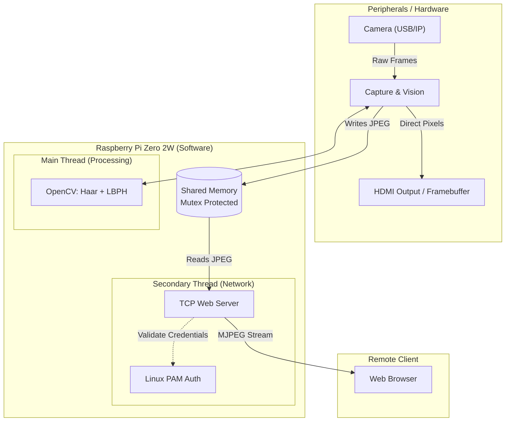
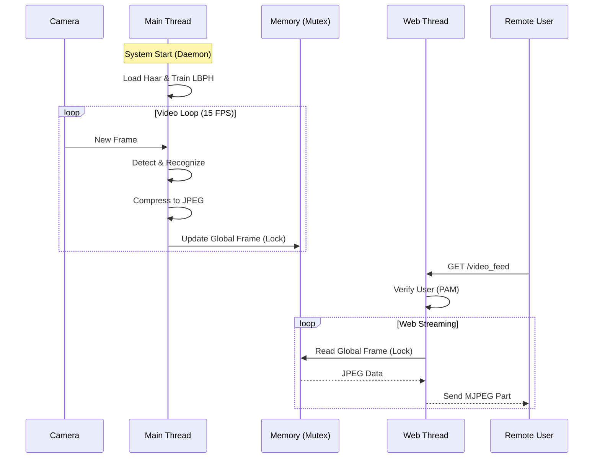

# Embedded Face Recognition and Video Surveillance System (RPI Zero 2W)

This repository contains the implementation of an intelligent security system designed to operate on limited-resource hardware, specifically optimized for the **Raspberry Pi Zero 2W**. The system integrates computer vision, concurrent processing, and network video streaming, operating in an autonomous ("Headless") and secure manner.

---

## 1. Problem Definition

Developing face recognition systems typically requires expensive hardware (GPUs, high-performance processors). The challenge of this project was to **implement a functional, real-time biometric recognition system on a low-cost, low-power device (Single Board Computer)**, managing limited resources (512MB RAM) and operating without peripherals.

**Key Challenges Addressed:**
* **Memory Scarcity:** Strict resource and Swap management required for compilation and execution.
* **Latency:** Simultaneous video processing and streaming without blocking.
* **Headless Environment:** Autonomous operation without a monitor, featuring a universal web interface.
* **Security:** Robust authentication without relying on vulnerable database files.

---

## 2. Architecture and Technical Solution

The solution was modularly designed in **C++17** to maximize performance, utilizing multi-threaded programming (`std::thread`) to decouple computer vision from network transmission.

### System Architecture Diagram



### Block A: Acquisition and Preprocessing

  * **Flexible Input:** The system accepts both physical cameras (index `0`) and network streams (`http://...`).
  * **Optimization:** Resizing to **640x480** and limiting to **15 FPS** for thermal stability.

### Block B: Computer Vision Core

  * **Detection (Haar Cascades):** Fast and lightweight algorithm for locating faces.
  * **Recognition (LBPH):** *Local Binary Patterns Histograms*. Trains a model at startup using photos in `assets/faces/` to identify individuals ("Johan" vs. "Unknown").

### Block C: Web Interface and Streaming

  * **MJPEG Protocol:** Video transmission via `multipart/x-mixed-replace`.
  * **Synchronization:** Use of `std::mutex` to protect access to shared memory.

### Block D: Security (Linux PAM)

  * **Real Authentication:** Validates credentials against the operating system users (`/etc/shadow`) using `security/pam_appl.h`.

### Data Flow Diagram



-----

## 3\. Project Structure

```text
Face Recognition/
├── assets/
│   ├── haarcascades/    # Detection models (auto-download)
│   └── faces/           # FACE DATABASE
│       ├── Johan/       # Folder with 10 photos of Johan
│       └── Visitante/   # Other folders...
├── src/
│   ├── sistema_final.cpp # Main source code
│   └── CMakeLists.txt    # Compilation configuration
├── scripts/
│   ├── install_dependencies.sh # Installs libraries
│   ├── build.sh                # Compiles the executable
│   └── run.sh                  # Startup script (Daemon Entrypoint)
├── logs/                # Access history in CSV
└── README.md            # Documentation
```

-----

## 4\. Installation and Setup

### Step 1: Hardware Configuration (Critical)

Increase Swap to 2GB to avoid compilation failures:

```bash
sudo nano /etc/dphys-swapfile
# Change to: CONF_SWAPSIZE=2048
sudo /etc/init.d/dphys-swapfile restart
```

### Step 2: Install Dependencies

```bash
cd "Face Recognition"
chmod +x scripts/*.sh
./scripts/install_dependencies.sh
```

### Step 3: Training

1.  Create a folder in `assets/faces/` with the person's name (e.g., `assets/faces/Johan`).
2.  Upload at least **10 clear photos** of the face.

### Step 4: Compilation

```bash
./scripts/build.sh
```

-----

## 5\. Execution and Usage

### Manual Mode

For direct testing:

  * **With USB Camera:**
    ```bash
    ./scripts/run.sh
    ```
  * **With Remote Stream (IP):**
    ```bash
    ./scripts/run.sh "[http://192.168.1.50:5000/video_feed](http://192.168.1.50:5000/video_feed)"
    ```

### Web Access

From any browser on the network:

  * **URL:** `http://<RASPBERRY_IP>:8080`
  * **Login:** Your Linux user and password (e.g., `johan` / `*****`).

-----

## 6\. Automation (Daemon Service)

To run the system as a Daemon (`face_access.service`) on startup:

1.  **Create service file:**

    ```bash
    sudo nano /etc/systemd/system/face_access.service
    ```

2.  **File Content:**
    *(Note the use of quotes to handle spaces in the folder name)*

    ```ini
    [Unit]
    Description=Face Recognition System (Daemon)
    After=network.target video.target

    [Service]
    Type=simple
    User=root
    # Adjust path if user is not 'johan'
    WorkingDirectory="/home/johan/Face Recognition"
    ExecStart=/bin/bash "/home/johan/Face Recognition/scripts/run.sh"
    Restart=always
    RestartSec=5
    StandardOutput=journal
    StandardError=journal

    [Install]
    WantedBy=multi-user.target
    ```

3.  **Activate:**

    ```bash
    sudo systemctl daemon-reload
    sudo systemctl enable face_access.service
    sudo systemctl start face_access.service
    ```

> **⚠️ NOTE ON LIFECYCLE:**
> The service only executes the compiled binary. If you modify code in `src/`, you must stop the service and run `./scripts/build.sh` manually.

-----

## 7\. Test Plan and Results

  * **Latency:** \~300-500ms on local network.
  * **Stability:** \>4 hours continuous operation with no memory leaks.
  * **Recovery:** Automatic restart (Daemon) in \<5s after failure.
  * **Headless:** Automatic detection of monitor absence.

-----

## 8\. Limitations Analysis

Given hardware constraints (limited ARMv8 CPU), classic algorithms were selected:

### Haar Cascades (Detection)

  * **Rotation Sensitivity:** Only detects frontal faces (max \~30° rotation).
  * **Lighting:** Sensitive to strong backlighting.

### LBPH (Recognition)

  * **Data Dependency:** Requires training lighting to match operational conditions.
  * **Scalability:** Efficient for few people (1-5), computation time grows linearly with more users.

-----

## 9\. Technologies

  * **Language:** C++17 (GCC 11.4)
  * **Vision:** OpenCV 4.6.0
  * **Security:** Linux PAM
  * **OS:** Raspberry Pi OS Lite (64-bit)

-----

*Project developed for the Embedded Linux Systems Programming course - Universidad Nacional de Colombia.*